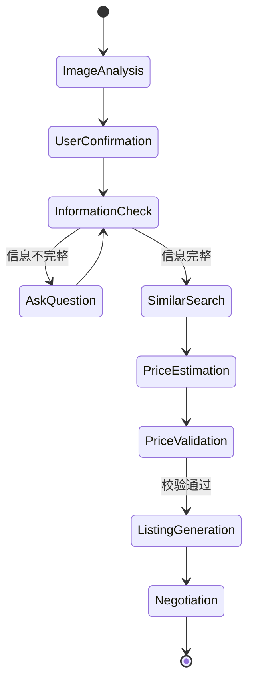

# ReSale Agent 架构说明

## 目标

V1 只做可演示、可测试、可讲清楚的一条出售工作流，不接入真实二手平台、不处理支付物流，也不把估价交给大模型自由发挥。

## 分层

- `frontend/`：Streamlit 前端，负责上传、确认、补充信息、查看方案和模拟议价。
- `backend/app/api/`：FastAPI 路由层，只做请求校验和服务编排。
- `backend/app/agent/`：Agent 状态节点，记录每一步执行轨迹。
- `backend/app/tools/`：确定性工具，包括字段检查、商品检索和价格计算。
- `backend/app/services/`：业务服务，包括识别降级、估价、文案、议价和导出。
- `backend/app/repositories/`：SQLite 读写。
- `backend/tests/`：核心规则和 API 链路测试。

## Agent 流程

## 关键设计

1. 估价由 `price_calculator.py` 的规则生成：折旧、成色、配件、维修、功能异常和相似商品中位数共同影响结果。
2. 图片识别默认使用安全降级结果，保证没有模型密钥也能跑通 Demo。未来接入模型时保持 Pydantic 结构化输出即可。
3. 用户确认后的字段会覆盖识别初稿，避免模型误识别直接影响最终文案和价格。
4. 议价回复会读取用户最低接受价，报价低于该价格时只建议拒绝或继续谈，不会主动建议接受。
5. 数据库中的 `reference_items` 默认是本地模拟数据，也可以通过 CSV 导入用户自有或授权成交样本；页面和报告会标明本地样本来源，且只允许停用、恢复、备注或删除用户导入样本。
6. 图片相似度只使用本地上传图片签名、原始文件名和识别线索辅助排序样本，不连接真实二手平台图片库。
